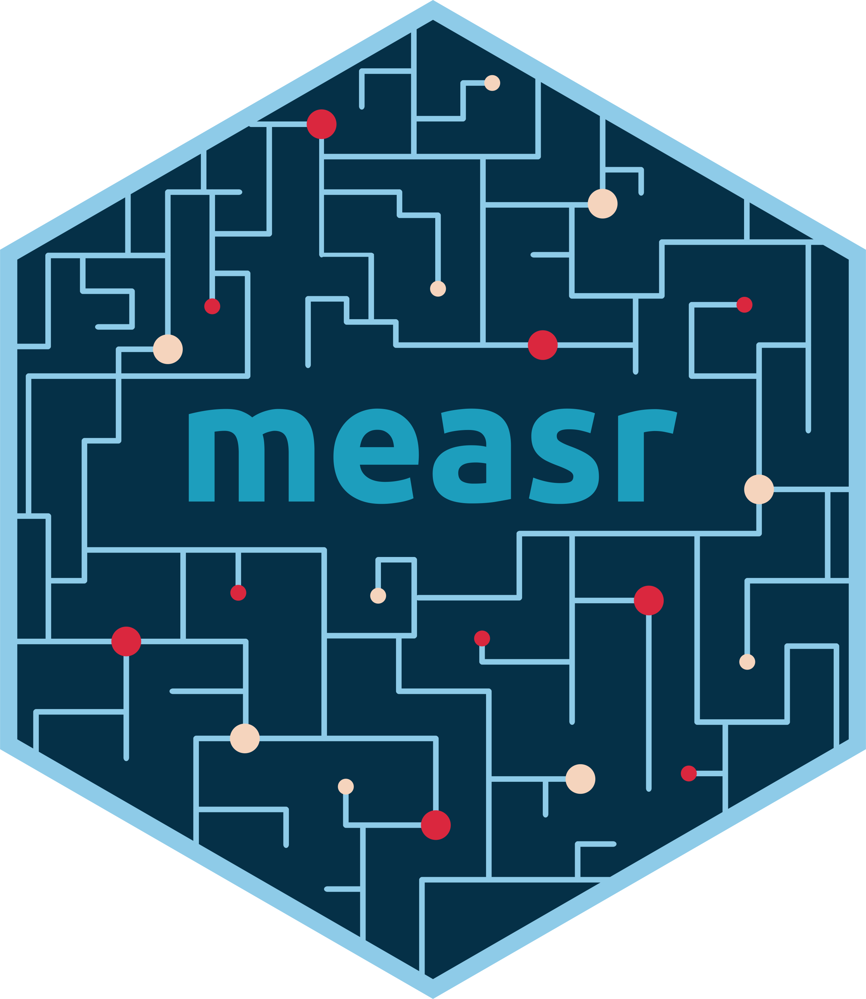

```{r setup}
library(tidyverse)
library(dcmdata)
library(ggmeasr)
library(knitr)
library(measr)
library(here)

set_theme(plot_margin = margin(5, 0, 0, 0))
```

## What are diagnositc models

* DCMs are psychometric models for the purpose of classification

* Fine-grained, multidimensional reporting

* Results that are instructionally useful for teachers, parents, and students ([Thompson & Clark, 2024](https://doi.org/10.1111/emip.12619))

## DCMs with Stan

:::{.columns}
:::{.column width="60%"}
* Stan is free and open-source
* Existing documentation for implementing DCMs
  * [Case study using the DINA model](https://mc-stan.org/learn-stan/case-studies/dina_independent.html)
  * [Paper describing LCDM implmentation](https://doi.org/10.3758/s13428-018-1069-9)
* Access to other packages in the Stan ecosystem
  * [loo](https://mc-stan.org/loo/), [tidybayes](http://mjskay.github.io/tidybayes/), [posterior](https://mc-stan.org/posterior/)
* Need an interface with R
  * Automate script generation
  * Facilitate model evaluations
:::

:::{.column width="40%"}
:::{.center}
{fig-alt="Stan logo."}
:::
:::
:::

# {.empty data-menu-title="measr" background-color="#023047" background-iframe="grid-worms/index.html"}

```{r}
#| label: big-image
#| out-width: 100%
#| fig-alt: "Hex logo for the measr R package."


```

## Data: Pathways for Instructionally Embedded Assessment (PIE)

* 15 items, measuring 3 attributes
  * Level 1, 2, and 3 skills in a grade 5 learning pathway
  * Skills follow a linear hierarchy: Level 1 -> Level 2 -> Level 3
  * Described by [ATLAS (2025)](https://pie.atlas4learning.org/sites/default/files/documents/resources/PIE_Assessment_Design_Development_Technical_Report.pdf)

* Available in the [dcmdata](https://dcmdata.r-dcm.org) package

```{r}
#| eval: false
#| echo: true

# remotes::install_github("r-dcm/dcmdata")
library(dcmdata)

?pie
```

## Specify a DCM

::::{.columns}
:::{.column width="37%"}
 * Choose from a wide variety of measurement models (e.g., LCDM, DINA, C-RUM)

 * Define attribute relationships through the structural model (e.g. HDCM, Bayesian Network)

 * Set prior distributions
:::

:::{.column width="4%"}
:::

:::{.column width="59%"}

<br>

```{r}
#| label: dcm-specify
#| echo: true

pie_hdcm_spec <- dcm_specify(
  qmatrix = pie_ft_qmatrix,
  identifier = "task",
  measurement_model = lcdm(),
  structural_model = hdcm("L1 -> L2 -> L3")
)
```

:::

::::

## Estimate a DCM

::::{.columns}
:::{.column width="47%"}
* Wraps *Stan* via `{rstan}` or `{cmdstanr}` packages

* Multiple estimatiom methods supported: MCMC, variational inference, or optimization
:::

:::{.column width="3%"}
:::

:::{.column width="50%"}
```{r}
#| label: dcm-estimate
#| echo: true

pie_hdcm <- dcm_estimate(
  dcm_spec = pie_hdcm_spec,
  data = pie_ft_data,
  identifier = "student",
  method = "mcmc",
  backend = "cmdstanr",
  chains = 4,
  iter_warmup = 5000,
  iter_sampling = 500,
  parallel_chains = 4,
  adapt_delta = .99,
  file = "fits/pie-model"
)
```

:::
::::

## Check model fit

```{r}
#| label: add-hdcm-fit
#| echo: false

pie_hdcm <- add_fit(pie_hdcm, method = c("ppmc"), model_fit = "raw_score")
```


::::{.columns}
:::{.column width="30%"}
* Posterior predictive model checks (PPMCs) to evaluate the fit of model to data

* PPMCs available at the model and item level
:::

:::{.column width="70%"}
```{r}
#| label: pie-raw-score-plot
#| warning: false
#| out-width: 100%
#| out-height: 50%
#| fig-alt: |
#|   Scatter plot showing the number of respondents at each score point in each
#|   iteration with the average and observed number of respondents overlayed.

draws <- fit_ppmc(pie_hdcm, model_fit = "raw_score", return_draws = 2000)

exp_scores <- draws$ppmc_raw_score$rawscore_samples |>
  pluck("rawscores") |>
  unnest(raw_scores) |>
  summarize(n = mean(n), .by = raw_score)

obs_scores <- pie_ft_data |>
  pivot_longer(-student) |>
  summarize(score = sum(value, na.rm = TRUE), .by = student) |>
  count(score)

draws$ppmc_raw_score$rawscore_samples |>
  pluck("rawscores") |>
  unnest(raw_scores) |>
  slice_sample(n = 500, by = raw_score) |>
  ggplot() +
  geom_point(
    aes(x = factor(raw_score), y = n),
    position = position_jitter(height = 0, seed = 1213),
    alpha = 0.2,
    color = palette_measr[4]
  ) +
  geom_point(
    data = exp_scores,
    aes(x = factor(raw_score), y = n),
    color = palette_measr[1],
    shape = 18,
    size = 5
  ) +
  geom_line(
    data = exp_scores,
    aes(x = factor(raw_score), y = n),
    group = 1,
    color = palette_measr[1]
  ) +
  geom_point(
    data = obs_scores,
    aes(x = factor(score), y = n),
    color = palette_measr[2],
    shape = 16,
    size = 5
  ) +
  geom_line(
    data = obs_scores,
    aes(x = factor(score), y = n),
    color = palette_measr[2],
    group = 1
  ) +
  scale_y_comma() +
  labs(x = "Correct Responses", y = "Respondents")
```

:::
::::

## Evaluate reliability

```{r}
#| label: calc-reli
#| echo: false

pie_hdcm <- add_reliability(pie_hdcm)
```

* Multiple types of reliability indices
  * Profile-level classification
  * Attribute-level classification
  * Probabilities

```{r}
#| label: pie-reliability
#| echo: true

measr_extract(pie_hdcm, "classification_reliability")
```

## Compare models

```{r}
#| label: pie-lcdm
#| echo: false

pie_lcdm_spec <- dcm_specify(
  qmatrix = pie_ft_qmatrix,
  identifier = "task",
  measurement_model = lcdm(),
  structural_model = unconstrained()
)

pie_lcdm <- dcm_estimate(
  dcm_spec = pie_lcdm_spec,
  data = pie_ft_data,
  identifier = "student",
  method = "mcmc",
  backend = "cmdstanr",
  chains = 4,
  iter_warmup = 5000,
  iter_sampling = 500,
  parallel_chains = 4,
  adapt_delta = .99,
  file = "fits/pie-all-profiles"
)

pie_lcdm <- add_criterion(pie_lcdm, criterion = "loo")
pie_hdcm <- add_criterion(pie_hdcm, criterion = "loo")
```

::::{.columns}
:::{.column width="47%"}
* Model comparisons with leave-one-out cross validation (LOO) with the `{loo}` package

* Equal fit between our two models indicates that our HDCM with the enforced hierarchy among the learning pathway levels is supported
:::

:::{.column width="3%"}
:::

:::{.column width="50%"}

<br>

```{r}
#| label: loo-compare
#| echo: true

loo_compare(
  pie_lcdm,
  pie_hdcm,
  model_names = c("LCDM", "HDCM")
)
```

:::
::::

# Learn more: [**r-dcm.org**](https://r-dcm.org) {.thank-you data-menu-title="Get in touch" background-color="#023047"}


:::{.columns .v-center-container}

:::{.column .image width="60%"}

:::{.center}
Slides
:::

```{r}
#| label: slides-qr-code
#| out-width: 50%
#| fig-alt: >
#|   QR code linking to https://ncme2026.wjakethompson.com


```

:::

:::{.column width="40%"}

:::{.thank-you-subtitle}

:::{.small}

<br>

 \ [wjakethompson.com](https://wjakethompson.com)  
 \ [wjakethompson@ku.edu](mailto:wjakethompson@ku.edu)  
 \ [0000-0001-7339-0300](https://orcid.org/0000-0001-7339-0300)  
 \ [in/wjakethompson](https://linkedin.com/in/wjakethompson)  
 \ [@wjakethompson](https://github.com/wjakethompson)  
 \ [@wjakethompson.com](https://bsky.app/profile/wjakethompson.com)  
 \ [@wjakethompson@fosstodon.org](https://fosstodon.org/@wjakethompson)  
 \ [@wjakethompson](https://www.threads.net/@wjakethompson)  
 \ [@wjakethompson](https://twitter.com/wjakethompson)  

:::

:::

:::

:::

## Acknowledgements

The research reported here was supported by the Institute of Education Sciences, U.S. Department of Education, through Grants [R305D210045](https://ies.ed.gov/funding/grantsearch/details.asp?ID=4546) and [R305D240032](https://ies.ed.gov/funding/grantsearch/details.asp?ID=6075) to the University of Kansas Center for Research, Inc., ATLAS. The opinions expressed are those of the authors and do not represent the views of the Institute or the U.S. Department of Education.
<br><br>

:::{.columns}
:::{.column width="15%"}
:::

:::{.column width="70%"}

```{r}
#| label: ies-logo
#| out-width: 100%
#| fig-align: center
#| fig-alt: |
#|   Logo for the Institute of Education Sciences.


```

:::

:::{.column width="15%"}
:::
:::
